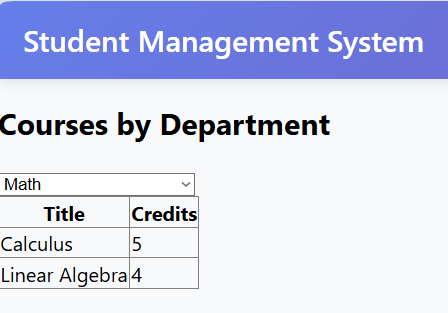

# LW6-8 - Лабораторная работа 6-8

## Описание
Веб-приложение на ASP.NET Web Forms с Entity Framework (Database First) для управления студентами и курсами. 
Проект включает страницы для просмотра, добавления студентов и курсов с возможностью сортировки.

**Цель варианта:** В `Students.aspx` вывести имя в формате **`LastName, FirstMidName`**
(через `TemplateField`) и дату зачисления `EnrollmentDate` с форматированием `{0:d}`.
Включить сортировку по обоим столбцам. Также присутствуют страницы `StudentsAdd.aspx`
(вставка) и `Courses.aspx` (связанный вывод по кафедрам).

> Проект собран как каркас с полностью готовыми страницами Web Forms, а подключение EF
(EDMX `Database‑First`) выполняется в 5–7 шагов ниже. Используется учебная БД Contoso School.

## Структура
- `Site.Master` — мастер-страница с меню.
- `Students.aspx` — GridView со столбцами:
  - **ФИО:** шаблон `LastName, FirstMidName` (TemplateField)
  - **EnrollmentDate:** BoundField с `DataFormatString="{0:d}"`
  - Сортировка включена.
- `StudentsAdd.aspx` — вставка (DetailsView/форма).
- `Courses.aspx` — DropDownList кафедр → список курсов.

## Настройка EF 6 (Database First) — 5 шагов
1. **Создайте БД School** (если нет):
   - Откройте SQL Server (LocalDB) и выполните скрипт из `App_Data/create_school.sql`.
2. **Добавьте EDMX**:
   - *Project → Add → New Item → Data → ADO.NET Entity Data Model → EF Designer from database*.
   - Создайте подключение к вашей БД (LocalDB) и отметьте таблицы: `Person`, `Department`, `Course`, `StudentGrade`.
   - Имя модели: **SchoolModel.edmx**. Пространство имён: **ContosoSchool**.
3. **Проверьте контекст**:
   - Должен создаться `SchoolEntities : DbContext` с DbSet-ами `People`, `Departments`, `Courses`, `StudentGrades`.
4. **Переименуйте FirstName → FirstMidName** (если в вашей схеме поле называется `FirstName`):
   - В EDMX и в `Mapping Details` переименуйте колонку в `FirstMidName` (или добавьте Computed колонку/представление).
5. **Правки на страницах**:
   - Ничего менять не нужно — страницы уже настроены на `EntityDataSource` с `ContextTypeName="ContosoSchool.SchoolEntities"`
     и `EntitySetName="People"`/`Courses`/и т.д.

> Важно: для удаления связанных записей включите каскад в БД (Person ↔ StudentGrade) или обработайте исключение.

## Проверка критерия варианта 4
- В `Students.aspx` сортировка по колонкам **ФИО** и **EnrollmentDate** работает,
  ФИО отображается как `LastName, FirstMidName`, дата — как краткая `{0:d}`.

## Запуск

### Web версия
1. Откройте решение `LW6-8.sln` в Visual Studio
2. Установите `WebApp` как стартовый проект
3. Нажмите `F5` или кнопку "Start Debugging"
4. Приложение откроется в браузере по адресу `http://localhost:port`

### Console версия (если есть)
1. Скомпилируйте проект в Visual Studio
2. Запустите исполняемый файл из папки `bin/Debug/`
3. Или запустите через командную строку:
   ```bash
   cd bin/Debug
   LW6-8.exe
   ```

## Примеры входных файлов

### XML конфигурация базы данных
```xml
<?xml version="1.0" encoding="utf-8"?>
<configuration>
  <connectionStrings>
    <add name="SchoolEntities" 
         connectionString="Data Source=(LocalDB)\MSSQLLocalDB;AttachDbFilename=|DataDirectory|\School.mdf;Integrated Security=True" 
         providerName="System.Data.SqlClient" />
  </connectionStrings>
</configuration>
```

### Пример данных студентов (SQL)
```sql
INSERT INTO Person (LastName, FirstName, EnrollmentDate) VALUES
('Иванов', 'Иван', '2023-09-01'),
('Петров', 'Петр', '2023-09-01'),
('Сидоров', 'Сидор', '2023-09-15');
```

## Скриншоты



